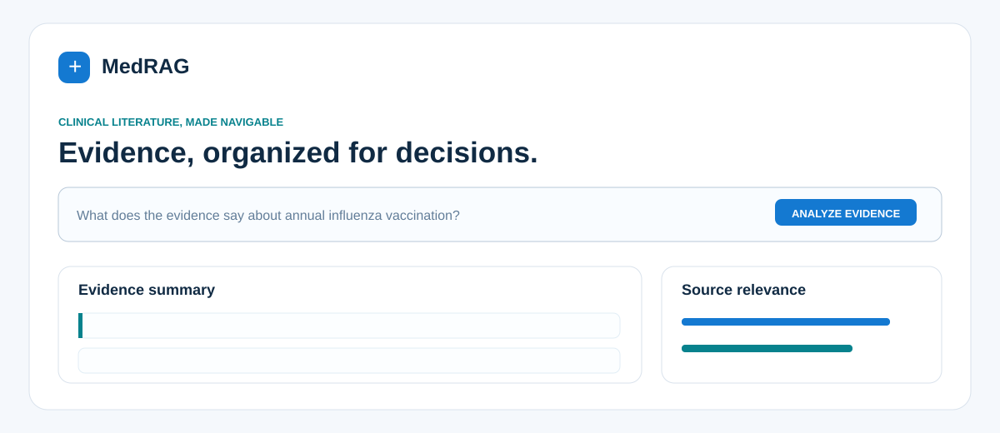
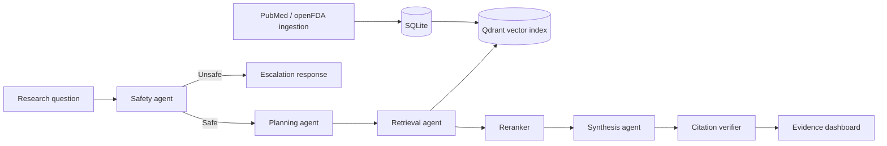

# MedRAG Evidence Agent

<p align="center">
  <strong>A safety-first clinical evidence research system for public literature.</strong><br />
  Source-grounded answers · transparent agent decisions · citation verification
</p>

<p align="center">
  <a href="#quick-start">Quick start</a> · <a href="#how-it-works">How it works</a> · <a href="#local-generation">Local generation</a> · <a href="#development">Development</a>
</p>

<p align="center">
  
  
  
  
</p>



> [!WARNING]
> **MedRAG is not a diagnostic tool and does not provide medical advice.** It is designed for research over public sources only. Never submit protected health information (PHI).

## Why MedRAG?

Medical questions need more than an ungrounded LLM response. MedRAG treats every request as an evidence-research workflow: it screens for unsafe prompts, plans research queries, retrieves and reranks public literature, synthesizes from evidence, and verifies citations before responding.

## Highlights

- **Safety first** — emergency and personal-treatment prompts are handled by an explicit safety gate.
- **Traceable research** — an inspectable `agent_trace` records each coordinator decision.
- **Evidence-grounded answers** — query decomposition, vector and lexical retrieval, and reranking improve source selection.
- **Citation verification** — answers are checked against retrieved sources before delivery.
- **Local by default** — embedded Qdrant, SQLite, caching, and rate limiting keep setup simple.
- **Useful interface** — the dashboard includes clickable citations, a source table, and a relevance chart.
- **Production-aware** — API-key mode, Prometheus metrics, golden evaluations, and CI are included.

## How it works



## Quick start

**Prerequisite:** Python 3.11 or later.

```powershell
python -m venv venv
venv\Scripts\activate
pip install -e ".[dev]"

$env:VECTOR_BACKEND="qdrant"
$env:QDRANT_PATH="data/qdrant"
uvicorn app.main:app --reload
```

Open the [evidence dashboard](http://127.0.0.1:8000) or [interactive API documentation](http://127.0.0.1:8000/docs).

### Run with Docker

```powershell
docker compose up --build
```

This starts the API and Qdrant. The dashboard is available at [http://127.0.0.1:8000](http://127.0.0.1:8000).

## Local generation

The included [`.env.example`](.env.example) targets Ollama's OpenAI-compatible endpoint. Copy it to `.env`, then start a local model:

```powershell
ollama pull llama3.2:3b
ollama serve
```

If a model is unavailable, MedRAG safely returns source-extractive, citation-bound evidence.

## Development

```powershell
pytest -q
ruff check app tests
```

Golden retrieval cases live in [`evals/golden_questions.json`](evals/golden_questions.json) and run in CI.

## Project structure

```text
app/       FastAPI application, agents, retrieval, ingestion, and UI
docs/      Architecture notes and dashboard preview
evals/     Golden retrieval evaluation cases
tests/     Automated tests
```

## Deployment notes

SQLite, in-process caching/rate limits, and embedded Qdrant make local deployment straightforward. For multi-instance deployment, the same interfaces can use Postgres, Redis, a durable queue, and managed Qdrant. See [the architecture notes](docs/architecture.md).

## License

Distributed under the [MIT License](LICENSE).